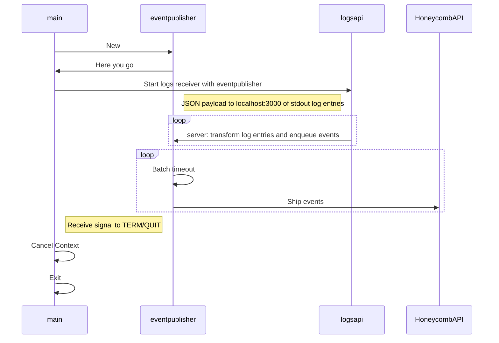
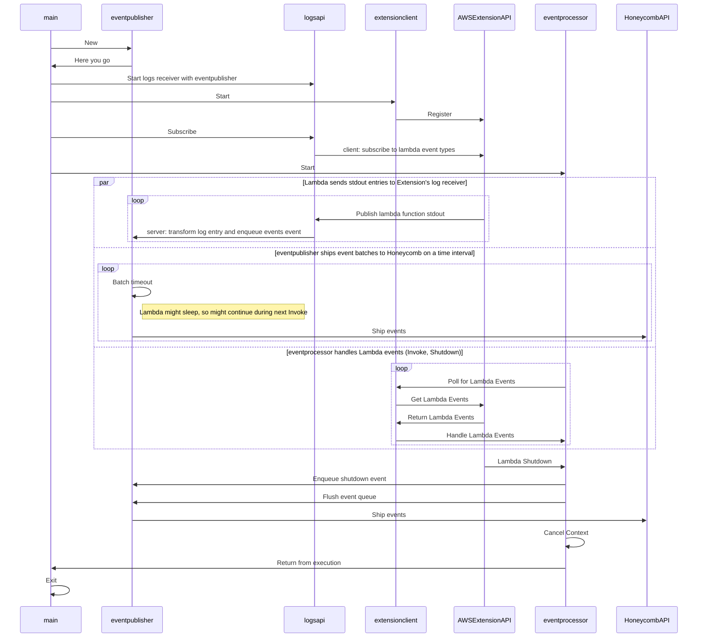

# Contributing Guide

Please see our [general guide for OSS lifecycle and practices.](https://github.com/honeycombio/home/blob/main/honeycomb-oss-lifecycle-and-practices.md)

## Design

### localMode

### In Lambda

